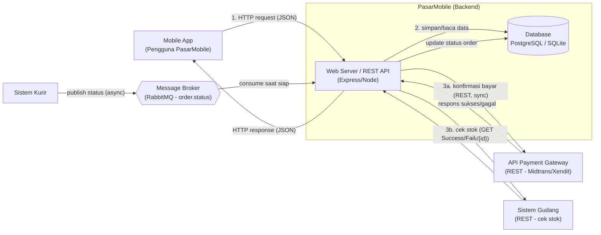

# Bagian B — Arsitektur Integrasi (Diagram Alur Data)

Diagram alur data PasarMobile yang menggambarkan koneksi antar sistem.
Komponen wajib: **Mobile App, Web Server, Database, & API/Broker**.

> Diagram di bawah memakai **Mermaid** (otomatis tampil sebagai gambar di GitHub).
> Untuk membuat ulang versi rapi, salin konsep ini ke **draw.io / Lucidchart / Figma**.

## Diagram Alur Data



## Penjelasan Alur (per metode integrasi)

1. **Synchronous (REST API) — Pembayaran & Cek Stok**
   - Mobile App mengirim **HTTP request (JSON)** ke Web Server dan menunggu respons.
   - Web Server memanggil **API Payment Gateway** (REST) dan/atau **Sistem Gudang**
     (REST), lalu mengembalikan hasilnya langsung ke Mobile App.
   - Status transaksi disimpan ke **Database**.

2. **Batch (File + Database) — Laporan Bulanan**
   - Web Server / job terjadwal membaca **Database** (atau file CSV ekspor) lalu
     menyimpan agregasi ke tabel laporan. Tidak real-time (sekali per bulan).

3. **Asynchronous (Message Broker) — Update Status Kurir**
   - **Sistem Kurir** mem-*publish* status ke **Message Broker** (queue `order.status`)
     lalu langsung lanjut.
   - Web Server meng-*consume* pesan **saat siap** (tidak overload), lalu memperbarui
     status order di **Database**.

## Pemetaan Komponen Wajib

| Komponen wajib | Pada diagram | Pada kode repo ini |
|----------------|--------------|--------------------|
| **Mobile App** | `MA` | simulasi di `kasus1-rest-api/demo.js` |
| **Web Server** | `WS` | `payment-api.js`, `bagian-c-rest-api/stock-shipment-api.js` |
| **Database** | `DB` | SQLite/PostgreSQL (`datasource.js`, `*-store.js`) |
| **API/Broker** | `PG`, `WH`, `MQ` | gateway REST, stock API, `kasus3-message-broker/broker.js` |

## Versi ASCII (alternatif tanpa render)

```
        +-------------+
        |  Mobile App |
        +------+------+
               | HTTP request/response (JSON)
               v
  ============ PasarMobile Backend ============
  |  +---------------------+    +-----------+  |
  |  |  Web Server / API   |--->| Database  |  |
  |  +----+-----------+----+    +-----------+  |
  ========|===========|=========================
          |           |                 ^
   (sync) |           | (sync)          | (async update)
          v           v                 |
   +-------------+  +------------+   +-----------------+
   | Payment     |  | Sistem     |   | Message Broker  |
   | Gateway API |  | Gudang API |   | (order.status)  |
   +-------------+  +------------+   +--------+--------+
                                              ^
                                              | publish status
                                       +------+------+
                                       | Sistem Kurir|
                                       +-------------+
```
